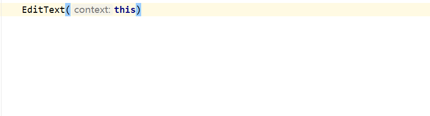
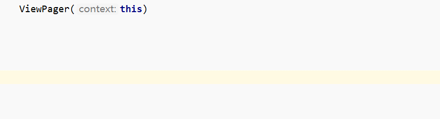
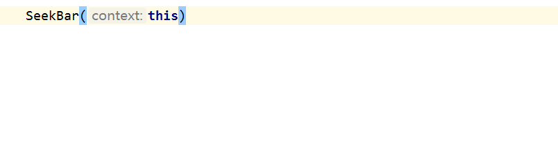
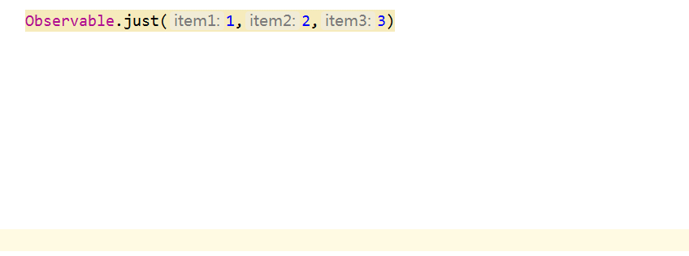

## kotlin-targetFun

---

[中文请看这里](./README_CN.md)

### Kotlin library for Android providing useful extensions to simplify interface callback in Android SDK. 

**Eh...Code is more expressive ：**

Using this lib,  you can add a TextWather to an EditText just like this：


	EditText(this)._addTextChangedListener {
            _onTextChanged { s, start, before, count ->
                //do sth
            }
        }

or like this

	
	EditText(this)._addTextChangedListener {
            _beforeTextChanged { s, start, count, after ->
                //do sth
            }
            _onTextChanged { s, start, before, count ->
                //do sth
            }
        }

or like this

 	EditText(this)._addTextChangedListener {
            _onTextChanged { s, start, before, count ->
                //do sth
            }
            _afterTextChanged {
                //do sth
            }
        }


**if you have used Rxjava in your project, you can use Observer like this:**

	
	Observable.just("1", "2", "3")
            ._subscribe {
                _onNext {
                    //do sth
                }
            }
or like this

 	Observable.just("1","2","3")
            ._subscribe {
                _onNext {
                    //do sth
                }
                _onError { 
                    //do sth
                }
            }

or like this

 	Observable.just("1","2","3")
            ._subscribe {
                _onNext {
                    //do sth
                }
                _onComplete {
                    //do sth
                }
            }


### Support Interfaces


- TextWatcher
- ViewPager.OnPageChangeListener
- Animator.AnimatorListener
- AbsListView.OnScrollListener
- RecyclerView.OnScrollListener
- SeekBar.OnSeekBarChangeListener
- View.OnAttachStateChangeListener
- DrawerLayout.DrawerListener
- View.OnClickListener（filter)
- Observer (rx)
- FlowableSubscriber (rx)
- Painted eggshell(๑*◡*๑)


### Setup


	repositories {
   		 jcenter()
	}

	dependencies {
   	 	implementation "com.cysion:targetfun:1.1.0"
	}

buildToolsVersion is default  28.0.2 in Android Studio lastest version 

### using TargetFun


Note that all methods in the lib start with _ , maybe it is nonstandard, but it is really convenient and symbolic.


**TextWatcher**



---
**OnPageChangeListener**



---
**OnSeekBarChangeListener**



---
**AnimatorListener**


---
**Observer**




**Painted eggshell**


Edittext extension funtion，open/hide keyboard

	EditText(this).openKeyBoard()

	EditText(this).hideKeyBoard()

filter too frequent click event

	Button(this)._setOnClickListener {
		}

jump to Activity, 1000 is one requestcode 

	_startActivityForResult<EditExActivity>(1000)

	_startActivity<EditExActivity>()


str(resid),  drawable(resid),color(resid)

	TextView(this).text=str(R.string.app_name)


todo...


### License

```

Copyright 2018 CysionLiu

Licensed under the Apache License, Version 2.0 (the "License");
you may not use this file except in compliance with the License.
You may obtain a copy of the License at

   http://www.apache.org/licenses/LICENSE-2.0

Unless required by applicable law or agreed to in writing, software
distributed under the License is distributed on an "AS IS" BASIS,
WITHOUT WARRANTIES OR CONDITIONS OF ANY KIND, either express or implied.
See the License for the specific language governing permissions and
limitations under the License.
```


